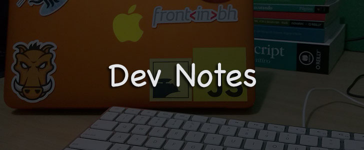

# Anotações de um Dev Front-End

Este repositório tem o objetivo de reunir de uma forma organizada, anotações e referências sobre meus estudos no mundo Front-End, porém irei incluir varias outras áreas relacionadas como Back-End, CLI Tolls, UX, etc...

> Para tentar manter a ordem,  temos um [guia de contribuição](contributing.md).

- [Front-End](#front-end)
- [Back-End](#back-end)
- [Data Bases (server side)](#data-bases-server-side)
- [Full Stack](#full-stack)
- [Software Architecture](#software-architecture)
- [Programming Paradigms](#programming-paradigms)
- [Design and UX](#design-and-ux)
- [Mobile Apps](#mobile-apps)
- [Games](#games)
- [CLI Tools](#cli-tools)
- [Infrastructure](#infrastructure)
- [Arduino](#arduino)
- [Workflow](#workflow)
- [Agile](#agile)

### Front-End
- **Markup**
  - For browsers
    - HTML elements
    - New HTML5.1 elements
    - Quality tests
  - For screen readers
    - WAI-ARIA
    - Tests
  - For Robots
    - Search engine
      - Microdate
      - Tests
    - Share
      - OpenGraph
  - For Humans
      - Markdown
      - Custom Elements
  - Preprocessors/template engine
      - Jade
      - Haml
- **Style**
  - Specification
  - Resets
    - Normalize
  - Tests
    - CSS lint
    - stylestats
  - Architecture
    - Atomic Design
    - OOCSS
    - SMACSS
    - BEM
    - DRY
  - Layout
    - Flexbox
  - Preprocessors
    - Sass
      - Libs and Framewoks
        - Compass
        - Bourbon
        - Susy
        - Neat
    - Stylus
  - Post-processors
    - postcss
  - Performance
  - CSS Level 4
- **Behavior**
  - EcmaScript
    - Sintax
  - Best practices
    - Conventions
  - Patterns
  - Frameworks
    - ReactJS
  - Frameworks mv*
    - AngularJS
      - 1x
      - 2x
    - EmberJS
    - BackboneJS
  - Libs
    - Jquery
    - hammer
    - zepto
  - Tests
    - Frameworks
      - Jasmine
      - Qunit
    - Testing levels
      - Unit tests
    - Methodologies
      - TDD
      - BDD
    - Task Runner
      - Karma
    - Tools
      - PhantonJS
    - Coverage
      - istanbul
  - Preprocessors
    - Coffe Script
    - Type Script
  - Modularization
    - ES6 Modules
    - AMD
    - RequireJS
    - Browserify
  - ES6 features
  - ES7 features
- **Debug**
  - Tools
    - Chrome DevTools
- **Accessibility**
  - Accessibility
- **Web browser engine**
  - Rendering Engine
    - how it works
    - Blink (Chrome & Opera)
    - Trident (Internet Explorer)
    - Gecko (Safari)
    - Webkit (Safari)
    - EdgeHTML (Edge)
- **Cross Browser**
  - Methodologies
    - Progressive Enhancement
    - Graceful Degradation
  - Tools
    - Modernizr
    - Caniuse
    - Browser Sync
- **SEO**
  - Google algorithms
    - Mobile Friendly
  - Tools
- **Adaptive Web Design**
  - Responsive Web Design
  - Adaptative images
    - srset
    - picture
  - Forms
  - Tools
  - Methodologies
    - Mobile First
    - Touch First
- **Web Components**
  - Specs
    - Custom Elements
    - HTML Imports
    - Templates
    - Shadow DOM
  - Libraries and Frameworks
    - Bosonic
    - X-Tags
    - Polymer
- **Static Generators**
  - Docpad
  - Jekyll
  - Harmonic
  - Middleman
  - Octopress
- **WPO**
  - [Web Performance Optimization](source/web-performance-optimization.md)
  - More Technics
    - Lazy loading
  - SPA
    - Single Pages Apps
    - Frameworks
      - SennaJS
- **Performance & Integration (API)**
  - Web Workers
  - History API
  - Drag and Drop
  -  Fullscreen API
  -  Typed Arrays
- **Connectivity**
  - Web Sockets
  - Server-Sent Events
  - WebRTC
- **Offline & Storage**
  -  Application Cache
  -  IndexDB
  -  Online and offiline events
  -  File API
  -  File System
  -  DOM Storage
- **Device Access**
  - Touch Events
  - Geolocation
  - Device Orientation
- **Multimedia**
  - Animation Timing
  - Web Audio
- **3D, Graphics & Effects**
  - Canvas
  - WebGL
  - SVG
- **Best Practices**
  - Code Style

### Back-End
- **NodeJS**
  - NodeJS
  - Frameworks
    - Express
- **Ruby**
  - Ruby
  - Frameworks
    - [Ruby on Rails](source/ruby-on-rails.md)
- **Python**
  - Python
  - Frameworks  
    - Django
    - Tornado

### Data Bases (server side)
- **SQL**
  - MySQL
- **NoSQL**
  - MongoDB

### Full Stack
- **MEAN**
- **Meteor**

### Software Architecture
- **MVC**
- **REST**

### Programming Paradigms
- **Object Orientation**
- **Functional Programming**
- **Orientation events**

### Design and UX
- vazio

### Mobile Apps
- **Phonegap**
- **React Native**
- **FirefoxOS**
- **Ionic**

### Games
- vazio

### CLI Tools
- **Shell Script**
- **NodeJS**

### Infrastructure
- vazio

### Arduino
- **Frameworks**
  - Johnny Five

### Workflow
- **Text editors**
  - [VIM](source/vim.md)
  - Sublime Text
  - Atom
- **Version control**
  - Tools
    - Git
    - Github
  - Methodologies
    - Semantic Versioning
- **Deploy**
  - Rsync
  - Capistrano
- **Continuous Integration**
  - jenkins
  - Travis-CI
- **Tasks Runners**
  - Grunt
  - Gulp
- **Package Managers**
  - Bower
  - NPM
- **Scaffolding**
  - Yeoman

### Agile
  - vazio

### Inspiração
[Eric Douglas - dev log](https://github.com/ericdouglas/dev-log)

### Licença
[MIT Licence](licence.md) © Afonso Pacifer
